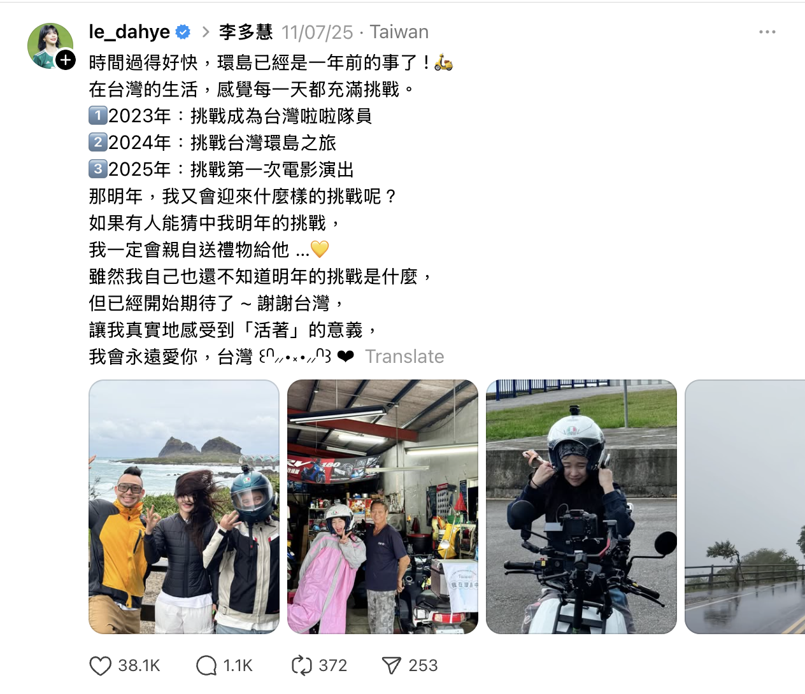
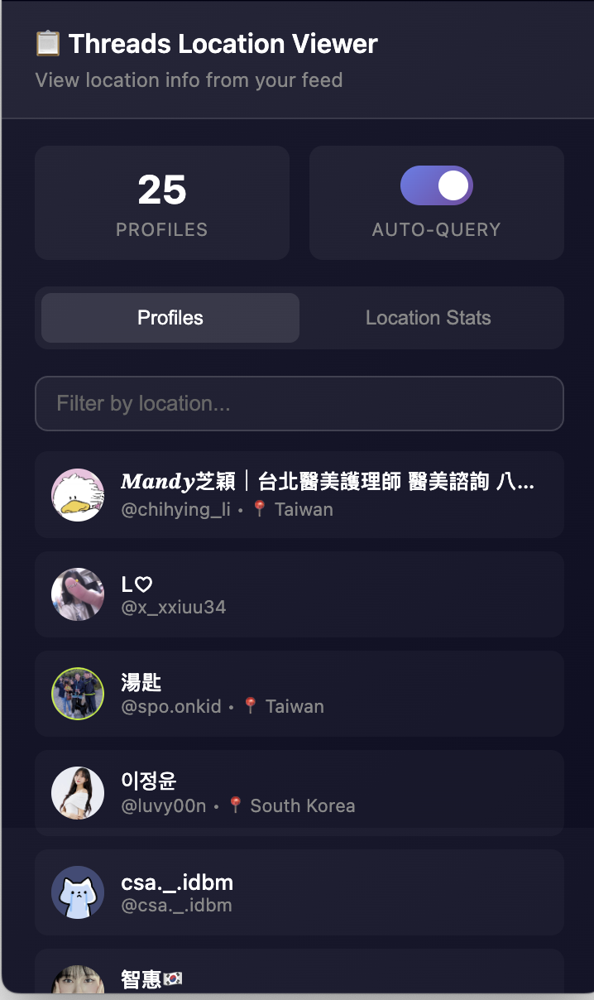
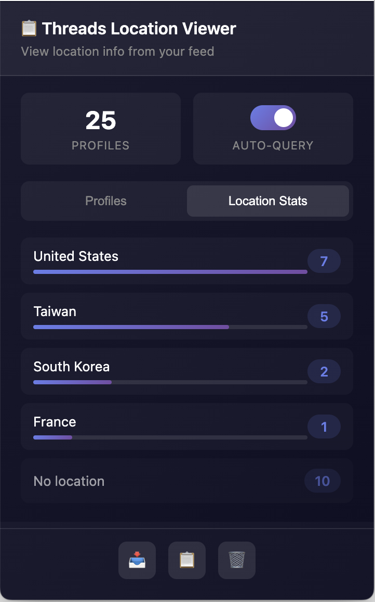

# Lee-Su-Threads 你是誰 (Safari/macOS 版)

一個 Safari 擴充功能（macOS），自動顯示 Threads 貼文作者的地點資訊，不需要點進每個人的個人檔案。

> ⚠️ **這是 Safari/macOS 版本分支。** Chrome 與 Firefox 版本請前往 [main 分支](https://github.com/meettomorrow/lee-su-threads/tree/main)。

> **[English](#english)** below

## 功能

- **自動擷取**：瀏覽動態時自動載入作者的地點資訊
- **地點標籤**：在貼文時間旁顯示作者所在地點
- **新用戶標記**：自動標示加入 Threads 未滿 30 天的新用戶
- **快取機制**：個人資料快取 72 小時，用戶 ID 快取 30 天
- **匯出資料**：可將所有資料匯出為 JSON
- **速率限制保護**：被 Threads 限制時會自動暫停並提醒

## 擷取的資訊

- **地點**：作者設定的所在地（例如：台灣）
- **加入時間**：加入 Threads 的時間

## 截圖

### 動態中的地點標籤


### 彈出視窗 - 個人資料列表


### 彈出視窗 - 地點統計


## 安裝方式 (Safari/macOS)

### 系統需求
- macOS 10.14 或更新版本
- Safari 14 或更新版本
- Xcode（用於建置）

### 從原始碼建置

1. Clone 此專案並切換到 safari-version 分支：
   ```bash
   git clone https://github.com/meettomorrow/lee-su-threads.git
   cd lee-su-threads
   git checkout safari-version
   ```

2. 安裝依賴並建置 JavaScript：
   ```bash
   npm install
   npm run build
   ```

3. 開啟 Xcode 專案：
   ```bash
   open src/src.xcodeproj
   ```

4. 在 Xcode 中選擇 **src (macOS)** scheme，然後按 **Cmd + R** 執行

5. 開啟 Safari 設定 → 延伸功能 → 啟用 **Lee-Su-Threads 你是誰**

### 啟用未簽署的擴充功能（開發者）

1. 開啟 Safari 設定 → 進階 → 勾選「**在選單列中顯示「開發」選單**」
2. 開啟 Safari 設定 → 開發者 → 勾選「**允許未簽署的延伸功能**」

## 使用方式

1. 前往 [threads.com](https://www.threads.com)
2. 正常瀏覽動態
3. 擴充功能會自動在貼文旁顯示地點標籤
4. 點擊工具列的擴充功能圖示可查看所有已擷取的資料

## 隱私說明

- 所有資料僅儲存在本機 Safari 儲存空間
- 不會將任何資料傳送到外部伺服器
- 快取會在 72 小時後自動清除

## 限制

- 需要 Threads 載入個人資料 API 才能擷取（通常瀏覽動態時會自動載入）
- 若 Threads 更改 API 格式，可能需要更新擴充功能
- 部分使用者可能未設定地點資訊

---

<a name="english"></a>

## English

A Safari extension (macOS) that automatically displays location info for Threads post authors without visiting each profile.

> ⚠️ **This is the Safari/macOS version branch.** For Chrome and Firefox, visit the [main branch](https://github.com/meettomorrow/lee-su-threads/tree/main).

### Features

- **Auto-fetch**: Automatically loads author location while browsing the feed
- **Location badges**: Shows location next to post timestamp
- **New user flagging**: Automatically marks users who joined Threads within the last 30 days
- **Caching**: Profile data cached for 72 hours, user IDs cached for 30 days
- **Export**: Export all data as JSON
- **Rate limit protection**: Auto-pauses and notifies when rate limited by Threads

### What's Extracted

- **Location**: User's set location (e.g., Taiwan)
- **Join date**: When the user joined Threads

### Screenshots

#### Location badges in feed


#### Popup - Profiles tab


#### Popup - Location Stats tab


### Installation (Safari/macOS)

#### Requirements
- macOS 10.14 or later
- Safari 14 or later
- Xcode (for building)

#### Build from Source

1. Clone this repository and switch to the safari-version branch:
   ```bash
   git clone https://github.com/meettomorrow/lee-su-threads.git
   cd lee-su-threads
   git checkout safari-version
   ```

2. Install dependencies and build JavaScript:
   ```bash
   npm install
   npm run build
   ```

3. Open the Xcode project:
   ```bash
   open src/src.xcodeproj
   ```

4. Select the **src (macOS)** scheme in Xcode, then press **Cmd + R** to run

5. Open Safari Settings → Extensions → Enable **Lee-Su-Threads 你是誰**

#### Enable Unsigned Extensions (Developers)

1. Open Safari Settings → Advanced → Check "**Show Develop menu in menu bar**"
2. Open Safari Settings → Developer → Check "**Allow unsigned extensions**"

### Usage

1. Navigate to [threads.com](https://www.threads.com)
2. Browse your feed normally
3. Location badges will automatically appear next to posts
4. Click the extension icon in the toolbar to view all extracted profiles

### Privacy

- All data is stored locally in Safari's storage
- No data is sent to external servers
- Profile cache is automatically cleared after 72 hours

## License

MIT License
